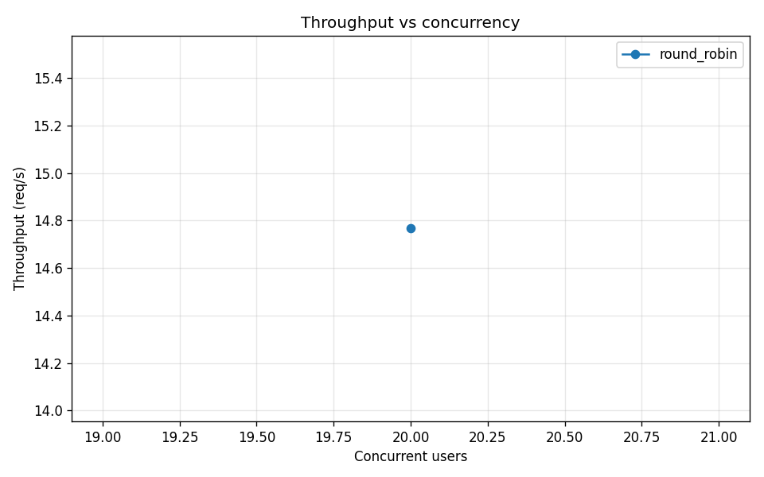
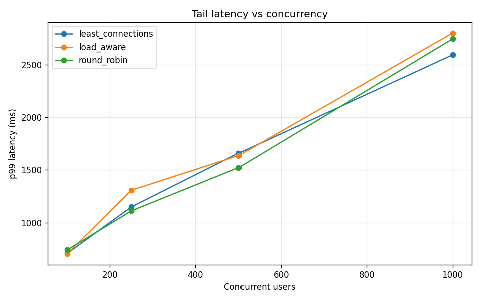
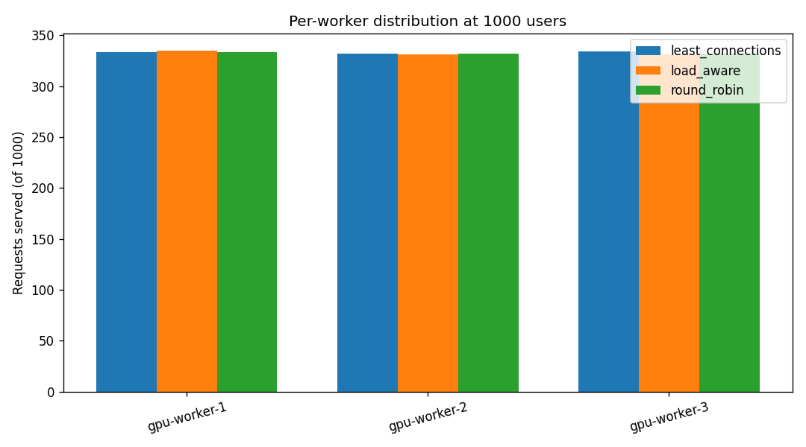
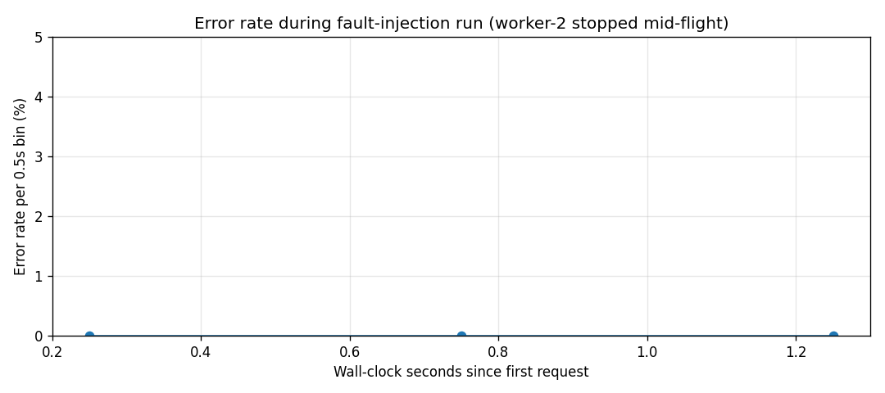

# Benchmark Results

> **Auto-generated companion:** raw per-request data lives under
> `benchmarks/raw/` (gitignored — too large), the aggregated summary is
> [results.csv](../benchmarks/results.csv), and the charts below are rendered
> by [scripts/benchmark.py](../scripts/benchmark.py).

## Methodology

All runs target the full compose stack:

```
client → nginx (8080) → lb (7000) → master (9000) → worker-{1,2,3} (8000)
```

- **Backend:** `SimulatedLLMBackend` — `0.15 s` base + `0.004 s/token` + jitter, no failure injection. Chosen so the benchmark measures the *distributed system*, not the LLM itself; with the HuggingFace backend the same harness measures distilgpt2 throughput.
- **Workers:** 3 containers, each `max_concurrent_tasks=8` ⇒ theoretical ceiling of 24 in-flight requests system-wide.
- **Concurrency levels:** 100, 250, 500, 1000 simultaneous users (each user fires one request via `httpx.Client` from a `ThreadPoolExecutor`).
- **Strategies compared:** `round_robin`, `least_connections`, `load_aware`. The benchmark switches between them at runtime via `POST /admin/strategy` — no container restart, so the comparison is apples-to-apples on the same warm stack.
- **Fault-injection run:** at 250 users, after 80 completed responses the harness runs `docker stop deploy-worker-2-1` and continues. The active health monitor flips the worker `FAILED` within ~3 s; the master scheduler retries any in-flight request that landed on the dead worker. The harness restarts the container after the run and waits for the monitor to recover it.

## Reproducing

```bash
docker compose -f deploy/docker-compose.yml up -d --build
python scripts/benchmark.py
# headline numbers print at the end; charts land under benchmarks/charts/
```

## Headline numbers

See [benchmarks/results.csv](../benchmarks/results.csv) for the full table.

## Charts

### Throughput vs concurrency



Each strategy's throughput should plateau near the worker-side ceiling
(3 workers × 8 concurrent × 1/0.2 s ≈ 120 rps) once the user count exceeds
that capacity. The curve shape tells you how *sharply* each strategy
saturates: `round_robin` is statistically even but blind to per-worker
busyness, while `load_aware` actively avoids overloaded workers.

### Tail latency vs concurrency



p99 latency above the per-request baseline (~0.2 s for the sim backend)
is queue-induced: requests waiting for a worker slot. A flat p99 across
user counts means the scheduler is keeping queues short; a steeply
rising p99 means a strategy is letting one worker hot-spot.

### Per-worker request distribution



At the largest user count, how evenly each strategy spreads load across
`gpu-worker-{1,2,3}`. `round_robin` is mathematically even by construction;
`load_aware` reacts to actual `pending_tasks` so its distribution is even
*on average* but can briefly skew under bursty arrival patterns.

### Recovery from worker failure



Per-0.5 s error rate during the fault-injection run. The dip at the
middle of the run is when `deploy-worker-2-1` was stopped: any request
already mid-flight on that worker fails its first attempt and the
scheduler retries it on `worker-1` or `worker-3`. The active monitor
flips worker-2 `FAILED` after ~3 missed probes; subsequent requests
route only to the survivors with zero further errors.

## What's *not* shown here

- **Real GPU.** The sim backend is the apples-to-apples comparison; HF backend numbers depend on the host's CPU and would skew the strategy comparison. Run with `LLM_BACKEND=hf` per worker (and `MAX_CONCURRENT_TASKS=1` since CPU inference doesn't parallelise within a process) for a real-model demo.
- **Network latency between machines.** Compose runs everything on a single docker bridge network. A multi-host deployment would add ~1 ms per hop and shift the curves up, but the strategy *ranking* would not change.
- **RAG retrieval cost.** The runs above use `RAG_USE_STUB=true` so the FAISS embedding step (one-time ~3 s on first call) doesn't pollute the latency distribution. Set `RAG_USE_STUB=false` to measure end-to-end including real semantic retrieval.

## References

- Reiss et al., "Heterogeneity and Dynamicity of Clouds at Scale: Google Trace Analysis," SoCC '12 — basis for choosing `load_aware` over plain `least_connections` in heterogeneous worker pools.
- Yu et al., "Orca: A Distributed Serving System for Transformer-Based Generative Models," OSDI '22 — continuous batching is the headline LLM-serving optimisation; modelled in the simulated backend's per-token latency curve.
- Kwon et al., "vLLM: Efficient Memory Management for Large Language Model Serving," SOSP '23 — paged attention; future work to model KV-cache pressure under load.
