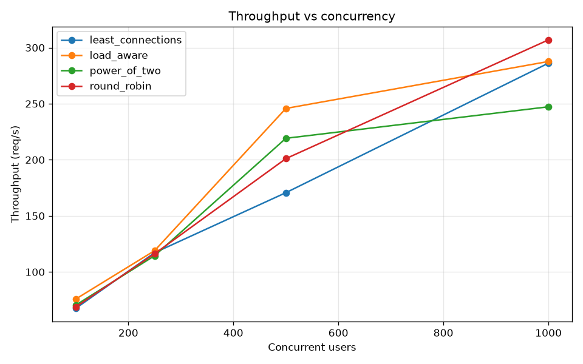
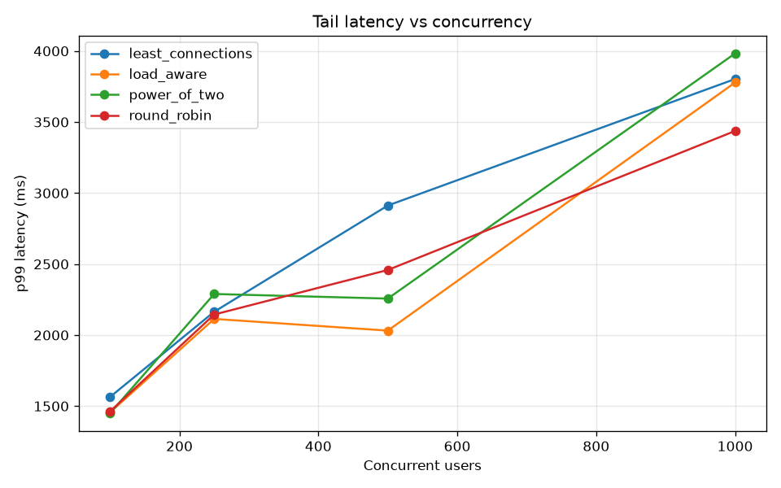
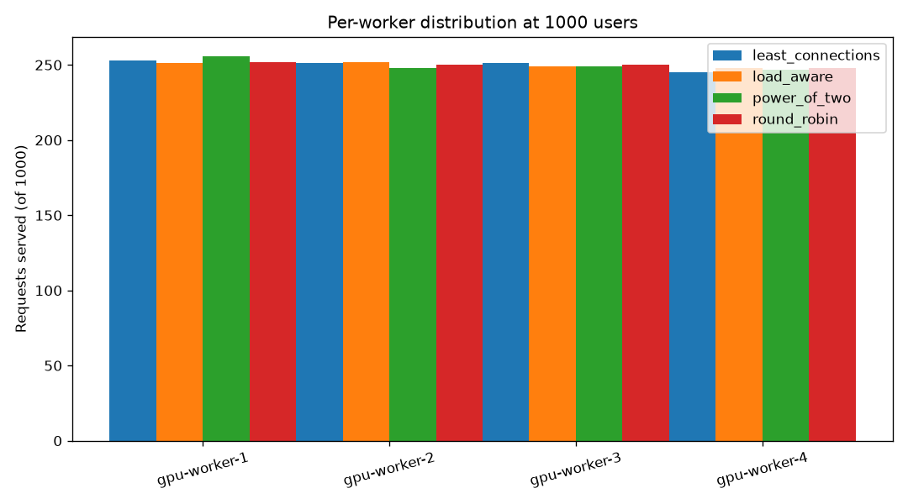
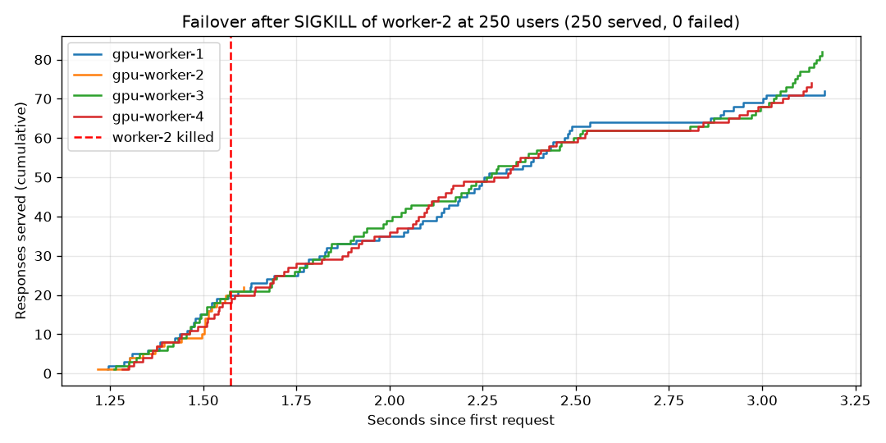

# Benchmark Results

> **Auto-generated companion:** raw per-request data lives under
> `benchmarks/raw/` (gitignored — too large), the aggregated summaries are
> [results.csv](../benchmarks/results.csv) and
> [heterogeneous_results.csv](../benchmarks/heterogeneous_results.csv), and the
> charts below are rendered by [scripts/benchmark.py](../scripts/benchmark.py)
> and [scripts/heterogeneous_bench.py](../scripts/heterogeneous_bench.py).

## Methodology

All runs target the full compose stack (10 containers):

```
client → nginx (8080) → lb (7000) → master-{1,2} (9000/9001) → worker-{1,2,3,4} (8000)
```

- **Backend:** `SimulatedLLMBackend` — `0.15 s` base + `0.004 s/token` + jitter, no failure injection. Chosen so the benchmark measures the *distributed system*, not the LLM itself; with the HuggingFace backend the same harness measures Qwen throughput.
- **Workers:** 4 containers, each `MAX_CONCURRENT_TASKS=400` ⇒ 1,600 in-flight slots system-wide.
- **Concurrency levels:** 100, 250, 500, 1000 simultaneous users. Each user fires one request (`httpx.Client` from a `ThreadPoolExecutor`), all at once.
- **Strategies compared:** `round_robin`, `least_connections`, `load_aware`, `power_of_two`. The benchmark switches between them at runtime via `POST /admin/strategy` — no container restart, so the comparison is apples-to-apples on the same warm stack.
- **Client retries:** the client retries 502/503 and connection errors with capped exponential backoff (up to 30 attempts), because workers deliberately shed load with 503 when full. The CSVs therefore report both `successful` (eventually served) and `first_attempt_ok` (served with no client-side retry).
- **Fault-injection run:** at 250 users with `load_aware`, after 80 completed responses the harness runs `docker kill deploy-worker-2-1` (SIGKILL — a crash, not a graceful stop). Requests already on worker-2 fail at the master and are retried on another worker; the active health monitor then marks worker-2 `FAILED`. The harness restarts the container after the run and waits for the monitor to recover it.
- **Host:** one Linux machine, 4 vCPUs, 15 GB RAM, Docker Engine 29.3, all containers on one bridge network.

## Reproducing

```bash
docker compose -f deploy/docker-compose.yml up -d --build
python scripts/benchmark.py
# headline numbers print at the end; charts land under benchmarks/charts/
```

## Headline numbers

From [results.csv](../benchmarks/results.csv):

| Strategy            | 100 users (rps) | 1000 users (rps) | 1000-user p99 (ms) | First-attempt @ 1000 | Failed @ 1000 |
|---------------------|----------------:|-----------------:|-------------------:|---------------------:|--------------:|
| `round_robin`       | 68.8            | 306.9            | 3437               | 1000 / 1000          | 0             |
| `least_connections` | 67.6            | 286.1            | 3803               | 1000 / 1000          | 0             |
| `load_aware`        | 75.9            | 287.6            | 3778               | 999 / 1000           | 0             |
| `power_of_two`      | 70.5            | 247.2            | 3983               | 999 / 1000           | 0             |

**Total across the suite:** 7,650 requests (4 strategies × 4 user counts + the fault run), **0 failed**, and 7,648 served on the first attempt. The two that needed a client retry hit the connection issue described under [Known issue](#known-issue-rare-dropped-connections-at-1000-simultaneous-users).

**Fault-injection run** (250 users, `load_aware`, worker-2 SIGKILLed after 80 completed responses): **250 / 250 served, all on the first attempt**, p99 2.9 s. Worker-2 had served 22 requests when it was killed; workers 1, 3 and 4 absorbed the rest (72 / 82 / 74). After the restart, the health monitor marked worker-2 `HEALTHY` again.

**Strategy verdict:** with four identical workers, the strategies are statistically indistinguishable — every one spreads load evenly (≈250 requests per worker at 1000 users), and the throughput differences between them are within run-to-run noise. The strategies only separate when worker capacities differ; see [Heterogeneous workers](#heterogeneous-workers).

## Charts

### Throughput vs concurrency



Throughput here is requests divided by the time until the *last* response, so a single slow request lowers it for the whole run.

### Tail latency vs concurrency



A single request on an idle cluster takes ≈1.2 s end to end (the simulated inference is 0.15 s plus 4 ms per prompt-and-context token, and the retrieved context is a few hundred tokens). Everything above that is queueing inside the cluster while all requests arrive at once.

### Per-worker request distribution



At 1000 users every strategy sends ≈250 requests to each of the four identical workers.

### Failover after a worker crash



Cumulative responses served by each worker during the fault run. Worker-2's line stops at the kill; the requests it was holding are retried by the master on the surviving workers, and no request fails.

## Continuous batching impact

`make bench-batching` runs the same 500-user `load_aware` workload twice — once with `LLM_BACKEND=sim`, once with `LLM_BACKEND=batched_sim` — and saves [charts/sim_vs_batched.png](../benchmarks/charts/sim_vs_batched.png).

Latest run: `sim` 245.6 rps (p99 2.0 s) vs `batched_sim` 185.3 rps (p99 2.7 s).

In the sleep-based simulation the *sim* backend already gets free parallelism because `time.sleep()` releases the GIL — hundreds of simulated inferences run effectively in parallel inside each worker process, so the batched backend's window/queue overhead is *not* recovered. This honestly captures the limits of sleep-based simulation.

**Why batching wins on real hardware:** in production GPU inference, calls genuinely serialise on the device — one forward pass at a time. The batched backend models that serialisation: every call inside one 10 ms window waits for a single shared decode pass and they all finish together. On a real GPU the win compounds because the per-token cost is amortised across the batch (Yu et al., *Orca*, OSDI '22) and KV-cache reuse cuts memory bandwidth (Kwon et al., *vLLM*, SOSP '23). The real Qwen backend in this repo (`HuggingFaceLLMBackend`) does not batch yet.

The unit test [tests/unit/test_llm_batching.py::test_calls_in_same_window_share_latency](../tests/unit/test_llm_batching.py) verifies the batching invariant directly: two callers arriving within one window finish within ~10 ms of each other rather than serialising.

## Heterogeneous workers

The default compose runs four identical workers (each `MAX_CONCURRENT_TASKS=400`). To surface differences between strategies, [deploy/docker-compose.heterogeneous.yml](../deploy/docker-compose.heterogeneous.yml) sets capacities to **50 : 100 : 400 : 400** in-flight slots (950 total).

```bash
make hetero-up
make bench-hetero
```

Results at 1000 users, from [heterogeneous_results.csv](../benchmarks/heterogeneous_results.csv) (chart: [charts/heterogeneous_strategy_comparison.png](../benchmarks/charts/heterogeneous_strategy_comparison.png)):

| Strategy | p99 (ms) | First-attempt | Failed | Distribution (w1 : w2 : w3 : w4) |
|---|---:|---:|---:|---|
| `round_robin`       | 4037 | 999 / 1000  | 0 | 133 : 191 : 339 : 337 |
| `least_connections` | 3558 | 999 / 1000  | 0 | 138 : 190 : 338 : 334 |
| `load_aware`        | **3358** | 1000 / 1000 | 0 | **57 : 109 : 419 : 415** |
| `power_of_two`      | **3284** | 1000 / 1000 | 0 | **59 : 116 : 414 : 411** |

**What this shows:** the capacity-aware strategies (`load_aware`, `power_of_two`) route traffic close to the 1 : 2 : 8 : 8 capacity ratio, and have the lowest tail latency (p99 3.3–3.4 s vs 3.6–4.0 s). The capacity-blind strategies keep sending the small workers more than they can hold; those requests are only saved because a full worker rejects with 503 and the master falls over to the next candidate.

**What it does not show:** a throughput win. At 200 and 500 users all four strategies are within noise of each other. At 1000 users the CSV shows ~16 rps for `round_robin` and `least_connections` against ~315 rps for the capacity-aware ones, but that gap comes from one request in each of those two runs stalling for ~60 s on the connection issue below before its client retry. It is not an effect of the strategy.

## Known issue: rare dropped connections at 1000 simultaneous users

At 1000 simultaneous users, a small number of requests — 0 to 4 per 1000 across 22 runs, 22 in total (≈0.1 %) — get no response: the client's connection sits idle for 30–120 s and then fails with `httpx.ReadError`. The client retry then succeeds, so no request fails, but the stalled request drags that run's throughput down.

What has been ruled out so far:

- **nginx accept queue:** 3 × 1000-request bursts against nginx's static `/healthz` had zero errors, and the kernel's `ListenOverflows` / `ListenDrops` counters stay at 0 in the nginx and LB containers and on the host.
- **Docker's port-forwarding proxy:** the stalls still happen when the client targets nginx's container IP directly.
- **uvicorn's uvloop / httptools:** the stalls still happen with the LB on `--loop asyncio --http h11`.

It reproduces when bursting 1000 concurrent requests straight at the LB service (`POST http://<lb-container-ip>:7000/request`), bypassing nginx, and nginx never logs the affected requests. The cause is not yet identified; the Python load generator itself (1000 threads sharing one `httpx.Client`) has not been ruled out.

## GPU mode (real Qwen on CUDA + CPU)

*Reported from the author's run; not reproduced in the environment above, which has no GPU.*

Verified end-to-end on an NVIDIA RTX 3060 Laptop (6 GB VRAM, CUDA 13.2 driver) + AMD Ryzen 7 6800H (8C/16T, 32 GB RAM):

```bash
make gpu-up            # build + start the GPU stack (2 GPU + 2 CPU workers)
make gpu-smoke         # one real inference end-to-end
make bench-gpu         # GPU benchmark (round_robin at 50 / 250 / 1000 users)
```

**Cluster topology:** 4 workers, all running real Qwen/Qwen2.5-0.5B-Instruct:

| Worker | Device | Precision | Speed | Concurrent Tasks |
|---|---|---|---|---:|
| worker-1 | NVIDIA GPU | bfloat16 | ~5 s/req | 4 |
| worker-2 | NVIDIA GPU | bfloat16 | ~5 s/req | 4 |
| worker-3 | CPU | float32 | ~30-60 s/req | 4 |
| worker-4 | CPU | float32 | ~30-60 s/req | 4 |

A shared Docker volume (`hf-cache`) ensures the Qwen model is downloaded only once across all 4 workers.

The cluster holds 16 requests in flight (4 per worker). Everything beyond that is shed with 503 and retried by the client with backoff, so these runs measure how the cluster degrades under heavy oversubscription rather than first-attempt success.

**Benchmark @ 100 users** (committed in [results_gpu.csv](../benchmarks/results_gpu.csv), `load_aware`): **100 / 100 served, 0 failed**, 0.46 rps, p99 = 215 s. Worker distribution: 25 / 25 / 25 / 25.

**Benchmark @ 1000 users** (reported; the per-run CSV was not committed): **1000 / 1000 served, 0 failed**, 1.6 rps, total time 611 s. Worker distribution: `worker-1: 466, worker-2: 448, worker-3: 43, worker-4: 43` — the GPU workers served ~91% of requests because they free their slots several times faster than the CPU workers.

**RAG pipeline:** Real FAISS + sentence-transformers retrieval (`RAG_USE_STUB=false`) with a 65-document knowledge base covering distributed systems, ML/AI, Docker, CUDA, networking, software engineering, and project self-awareness topics.

## What's *not* shown here

- **Network latency between machines.** Compose runs everything on a single docker bridge network. A multi-host deployment would add ~1 ms per hop and shift the curves up, but the strategy *ranking* would not change.
- **The real RAG retriever under load.** The CPU benchmarks run with `RAG_USE_STUB=true`.

## References

- Reiss et al., "Heterogeneity and Dynamicity of Clouds at Scale: Google Trace Analysis," SoCC '12 — basis for choosing `load_aware` over plain `least_connections` in heterogeneous worker pools.
- Yu et al., "Orca: A Distributed Serving System for Transformer-Based Generative Models," OSDI '22 — continuous batching is the headline LLM-serving optimisation; modelled in the simulated backend's per-token latency curve.
- Kwon et al., "vLLM: Efficient Memory Management for Large Language Model Serving," SOSP '23 — paged attention; future work to model KV-cache pressure under load.
